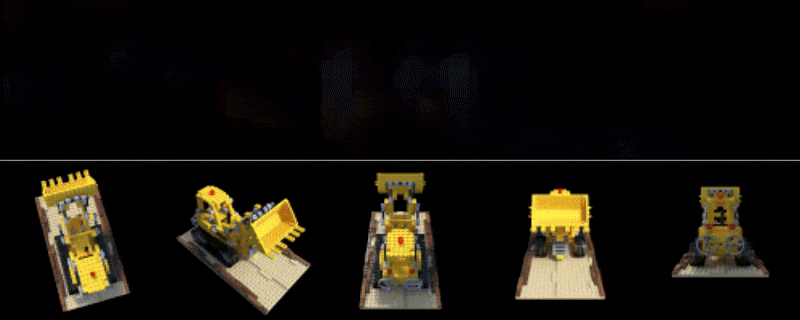

# NeRF from scratch 
Reproducing the paper ["NeRF: Representing Scenes as Neural Radiance Fields for View Synthesis"](https://arxiv.org/abs/2003.08934) ECCV 2020

### Clone and install dependencies
``` 
git clone https://github.com/aldipiroli/nerf_from_scratch
pip install -r requirements.txt
``` 
### Train 
``` 
cd python 
python train.py
```
### Examples
Rendering samples from novel views over approximately ~10k iterations.


> Note: this repository is just for learning purposes and does not aim at the performance of the [original repository](https://github.com/bmild/nerf). Additionally, some features from the original model are not implemented (i.e., hierarchical volume sampling).